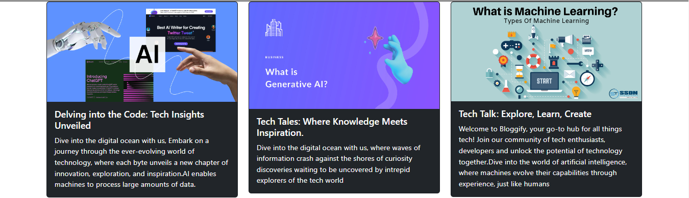

# Bloggify

Welcome to the Bloggify Website! This website is dedicated to providing users with the latest updates, news, and insights from the world of technology. Whether you're interested in IT industry trends, software development, gadgets, or emerging technologies, you'll find a wealth of information here in the form of blog posts.

## Features

- **Explore Blogs:** Browse through a variety of tech-related blog posts, covering topics such as software development, artificial intelligence, cybersecurity, cloud computing, and more.
- **Responsive Design:** The website is designed to be fully responsive, ensuring a seamless user experience across desktop, tablet, and mobile devices.
- **Search Functionality:** Easily search for specific topics or keywords using the built-in search feature, making it convenient to find relevant blog posts.
- **User-Friendly Interface:** The intuitive interface and card-based layout make it easy for users to navigate the website, discover new content, and consume knowledge.
- **Bootstrap Design:** The website is designed using the Bootstrap framework, ensuring a modern and visually appealing design.

## Tech Stack

- **Angular Framework:** Angular is used as the primary framework for building the frontend of the website, providing a robust and scalable architecture for managing components and data.
- **Bootstrap:** Bootstrap is utilized for designing the user interface, offering a wide range of responsive design components and utilities to create a visually appealing website.
- **HTML/CSS:** Standard markup and styling languages are used to create and style the website's layout and appearance.

## Quick Intro
### Home page


### Cards Section


### login/signup section


### Explore topics





## Getting Started

To get started with the project, follow these steps:

1. Clone the repository:
   ```
   git clone https://github.com/aryyan0701/Bloggify.git
   ```
2. Navigate into the project directory:
   ```
   cd your_project_name
   ```
3. Install dependencies:
   ```
   npm install
   ```
4. Start the development server:
   ```
   npm run start
   ```
5. Open your browser and visit `http://localhost:4200` to view the application.

## Usage

- Explore the different categories and topics available on the website.
- Click on a blog post card to view the full article.
- Use the search functionality to find specific blog posts by keywords or topics of interest.
- Enjoy reading and consuming the latest updates and insights from the world of technology!

## Contributors

- [Aryan Kadam](https://github.com/aryyan0701) - Project Lead & Developer

## License

This project is licensed under the MIT License - see the [LICENSE](LICENSE) file for details.

## Acknowledgements

- Bootstrap for providing a powerful and flexible design framework.
- Angular community for continuous support and updates.

## Further help

To get more help on the Angular CLI use `ng help` or go check out the [Angular CLI Overview and Command Reference](https://angular.io/cli) page.

Thank You ..!!
